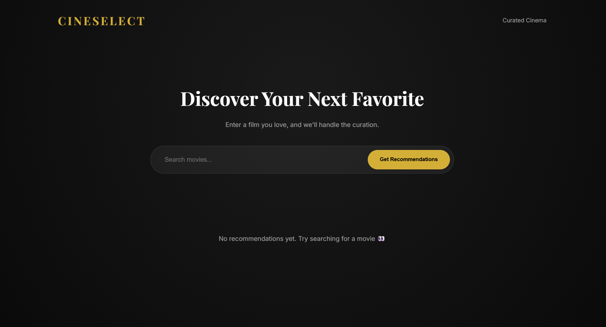
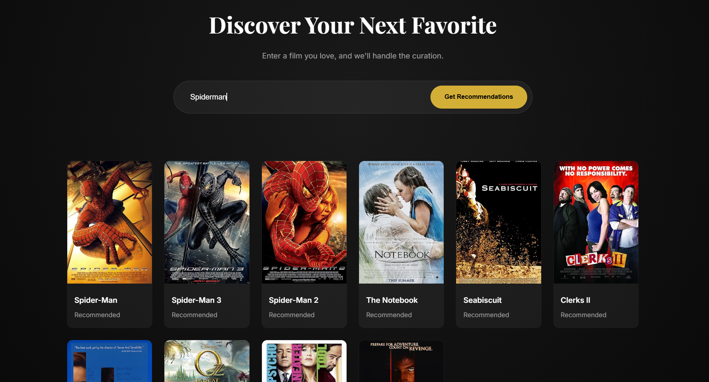
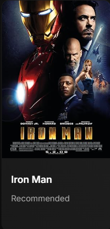

# Movie Recommendation System (Content-Based Filtering)

## Overview

This project is a content-based movie recommendation web application built using Flask and scikit-learn. Given a movie title, the system suggests similar movies by analyzing textual features such as genres, keywords, tagline, cast, and director.

The project demonstrates how recommendation systems can be implemented using traditional NLP techniques and similarity metrics without collaborative filtering.

---

## Features

* Content-based movie recommendations
* TF-IDF vectorization of movie metadata
* Cosine similarity ranking
* Fuzzy title matching using difflib
* Poster fetching using OMDb API
* In-memory caching for poster optimization
* Clean web interface using Flask and Jinja2

---

## Tech Stack

* Backend: Python, Flask
* Data Processing: Pandas, NumPy
* NLP & ML: scikit-learn (TfidfVectorizer, cosine_similarity)
* Matching: difflib
* API: OMDb API
* Frontend: HTML, CSS, Jinja2
* Utilities: requests

---

## How It Works

### 1. Dataset Loading

The application loads `movies.csv` into a Pandas DataFrame during initialization.

### 2. Feature Selection

The following columns are used:

* genres
* keywords
* tagline
* cast
* director

Missing values are replaced with empty strings.

### 3. Feature Engineering

All selected columns are combined into a single text string per movie, forming a unified content representation.

### 4. Vectorization

The combined text is transformed into TF-IDF vectors using `TfidfVectorizer`, converting each movie into a numerical representation.

### 5. Similarity Computation

Cosine similarity is computed across all movie vectors to create a similarity matrix. This is done once during startup for faster runtime recommendations.

### 6. Query Matching

User input is matched against movie titles using `difflib.get_close_matches`.
If no close match is found, the system returns no recommendations.

### 7. Recommendation Generation

Movies are ranked based on similarity scores, and the top matches are returned.

For each recommendation:

* Poster is fetched using the OMDb API
* Poster URLs are cached in memory to reduce repeated API calls

---

## Project Structure

```text
Movie-Recommendation/
│── README.md
│── app.py
│── recom.py
│── movies.csv
│
├── static/
│   └── style.css
│
└── templates/
    └── index.html
```

---

## Installation and Setup

```bash
git clone https://github.com/your-username/movie-recommendation.git
cd movie-recommendation
pip install -r requirements.txt
python app.py
```

Open in browser:

```id="gzk7ep"
http://127.0.0.1:5000
```

---

## Screenshots

### Home Page 



### Recommendation Results



### Poster Fetching Example



---

## Limitations

* Recommendations are limited to the local dataset
* No collaborative filtering or user-based personalization
* Queried movie may appear in recommendations
* Depends on OMDb API availability for posters

---

## Future Improvements

* Remove queried movie from recommendations
* Add collaborative filtering or hybrid recommendation system
* Improve ranking with weighted features
* Store poster cache in a persistent database
* Deploy application for public access

---

## Key Takeaway

This project demonstrates a complete content-based recommendation pipeline, including data preprocessing, feature engineering, TF-IDF vectorization, cosine similarity ranking, fuzzy matching, and web-based result presentation.

---

## Contact

Prajit Ramachandran
Email: [ramachandranprajit@gmail.com](mailto:ramachandranprajit@gmail.com)

---

If you find this project useful, consider starring the repository.
